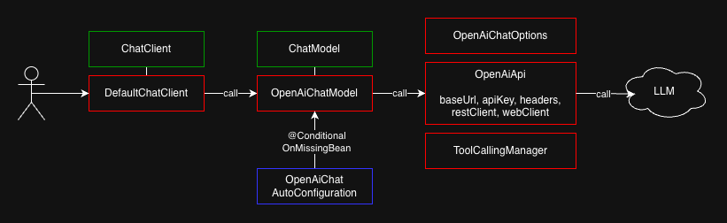
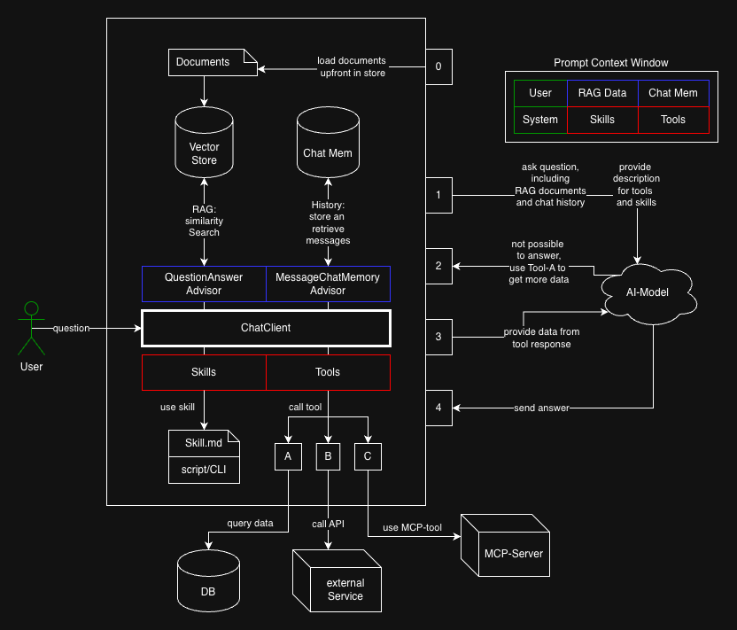
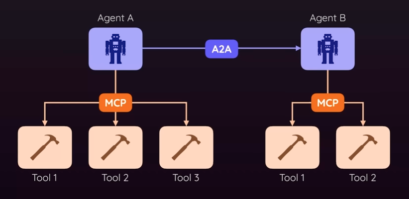
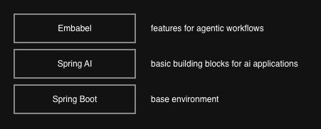

# Spring AI Example

## Important Setup

- add your OPENAI_API_KEY to the environment (e.g. in Intellij), check out application.yml
- no database needed, the vector store and chat memory are in-memory, just run the app

## Basic Chat Config

- the ChatClient is the main entry point for all ai-interactions
- it uses internal an implementation of the ChatModel interface, e.g. OpenAiChatModel
- the OpenAiChatModel will be autoconfigured through OpenAiChatAutoConfiguration
- in there you find the defaults for the model, e.g. the url, name, temperature, etc.
- the AutoConfiguration comes in via transitive dependency from spring-ai-starter-model-openai
- your personal OPENAI_API_KEY will be embedded in OpenAiApi as Bearer-Header

## Chat Memory

- Info:
  - https://docs.spring.io/spring-ai/reference/api/chat-memory.html
  - store previous conversations for better context in future interactions
- Setup: 
  - MessageChatMemoryAdvisor (check out ChatClientConfig)
  - can be in-memory or persistent
- Testing:
  - add breakpoint in MessageChatMemoryAdvisor-before() to see stored messages
  - Mein Name ist Robin → http://localhost:8080/chat?message=Mein%20Name%20ist%20Robin
  - Wie ist mein Name? → http://localhost:8080/chat?message=Wie%20ist%20mein%20Name%3F
  - the previews stored user and assistant messages are attached to the current prompt 
  - so the assistant has context and can answer the question correctly
- Other examples:
  - https://github.com/danvega/spring-ai-workshop/blob/main/src/main/java/dev/danvega/workshop/memory/StatefulController.java
  - https://github.com/joshlong-attic/2026-02-18-bootiful-dogumentary/blob/main/assistant/src/main/java/com/example/assistant/AssistantApplication.java

## RAG

- Info:
  - https://docs.spring.io/spring-ai/reference/api/retrieval-augmented-generation.html
  - query in vector database to find additional documents before calling the ai
- Setup: 
  - for easy use-cases: QuestionAnswerAdvisor + SearchRequest (check out ChatClientConfig)
  - for more complex use-cases: RetrievalAugmentationAdvisor
  - the vector store can be an in-memory file or a persistent database
- Testing:
  - add breakpoint in QuestionAnswerAdvisor-before() to see similar documents
  - Womit kennt sich Robin aus?→ http://localhost:8080/chat?message=Womit%20kennt%20sich%20Robin%20aus%3F
    - vectorStore.similaritySearch() finds 4 documents (because of DEFAULT_TOP_K = 4)
    - the ai filters out Robin and answers correct
  - Welche Backend-Entwickler kennst du? → http://localhost:8080/chat?message=Welche%20Backend-Entwickler%20kennst%20du%3F
    - vectorStore.similaritySearch() finds apart from 2 backend-dev's also 2 fullstack-dev's (because similar skill-set)
    - the ai filters out the backend-dev's and answers correct
  - Wer kennt sich mit Datenhaltung aus? → http://localhost:8080/chat?message=Wer%20kennt%20sich%20mit%20Datenhaltung%20aus%3F
    - vectorStore.similaritySearch() finds apart from Postgres & MongoDB-experts also 2 Spring-dev's
    - the ai filters out the db-experts and answers correct
- Other examples:
  - https://github.com/danvega/spring-ai-workshop/blob/main/src/main/java/dev/danvega/workshop/rag/ModelsController.java
  - https://github.com/joshlong-attic/2026-02-18-bootiful-dogumentary/blob/main/assistant/src/main/java/com/example/assistant/AssistantApplication.java
  - do RAG manually, check of https://github.com/coc-university/spring-ai-rag-example

## Tool Calling

- Info:
  - https://docs.spring.io/spring-ai/reference/api/tools.html
  - the ai requests a call to a specific tool to get additional information or trigger an action
- Setup:
  - for internal tools: use @Tool on method in spring bean (check out DemoRepoTools)
  - for external tools that are on a remote server use mcp (not in this repo)
    - info: https://docs.spring.io/spring-ai/reference/1.0/api/mcp/mcp-overview.html
    - your app is the client, the tools are located on the server
    - e.g. call a gmail mcp-server to read your mails
    - example: https://github.com/coc-university/spring-ai-mcp-example
- Testing
  - Erzähle mir etwas über Robin und seine Demo-Repos → http://localhost:8080/chat?message=Erz%C3%A4hle%20mir%20etwas%20%C3%BCber%20Robin%20und%20seine%20Demo-Repos
    - the ai calls the tool getDemoRepoFromOwner() to get the information about Robin's repos and answers correct
- Other examples:
  - https://github.com/danvega/spring-ai-workshop/tree/main/src/main/java/dev/danvega/workshop/tools
  - https://github.com/tzolov/playground-flight-booking/blob/main/src/main/java/ai/spring/demo/ai/playground/services/BookingTools.java

## Skills

- Info:
  - https://spring.io/blog/2026/01/13/spring-ai-generic-agent-skills
  - https://docs.spring.io/spring-ai/reference/api/chat/anthropic-chat.html#_skills
  - a skill is a reusable piece of text/logic that can be used by the ai to perform a specific task
    - extend the context with additional instructions/process-logic
    - or trigger an action through scripts/CLIs, e.g. python-code or bash
  - it has a header with name plus description and a body with the actual content
  - there is a growing ecosystem of skills, e.g. https://skills.sh 
- SkillsJars:
  - a way to package/bundle and share skills as reusable jars
  - with versions, security checks, etc.
  - can be published to maven central and used as dependencies in other projects
  - or extract the skills via plugin to use it in Claude/Codex/etc
  - https://app.daily.dev/posts/announcing-skillsjars---agent-skills-on-maven-central-hlqsuhas6
- Examples:
  - https://github.com/spring-ai-community/spring-ai-agent-utils/tree/main/examples/skills-demo
  - https://github.com/jamesward/agent-integration-demo/blob/main/src/main/java/com/jamesward/BasicSkills.java

## Comparison MCP-Tools vs Skills

- MCP-Tools:
  - externalize logic
    - if you want to move the logic to an external server and collect it there
    - some kind of deployment necessary to use it
  - advantages
    - better for security/auth and maintainability
    - can use auditing/logging/monitoring on the server side
    - easy to integrate into deployed microservices
    - can be used by Browser-UIs like ChatGPT (connectors)
  - context window problem
    - needs much space if loaded all at once in the beginning
    - reduction possible via search feature in MCP, so load only on demand
    - https://www.anthropic.com/engineering/advanced-tool-use
- Skills:
  - if you want to keep the text/logic in the same project
  - better for performance and simplicity
  - more for programms that run locally on your laptop
  - authentication via credentials happens locally
  - can also take actions through scripts / CLIs, similar to tools
  - needs less space in the context window

## How to provide context information?

- internal knowledge → use RAG
  - e.g. company policies, jira-tickets, etc.
  - can be big and complex, needs search
- real time data → use (mcp) tools
  - e.g. live weather, stock prices, etc.
  - or your internal data that changes frequently, e.g. inventory table, etc.
  - can be not provided statically upfront in the prompt
- process logic → use skills
  - e.g. generate a report, format a document, etc.
  - can be public or company-internal
- combine context information → use RAG + tools + skills
  - e.g. usecase: generate a report
  - first: query documents for the report-body via RAG 
  - second: fetch up-to-date information for the report-header via tools
  - end: use a skill to generate the formatted report

## Architecture

## Agents
- what is an agent?
  - an agent has more responsibilities than just calling a tool for one task
  - it manages the whole process of solving a complex problem, which can include multiple steps
  - so orchestrate/plan the steps and execute them as workflow, including state management, error handling, etc
  - e.g. not only book the flight, but also check the weather at the destination, find a hotel, and so on
  - so using an agent is like moving the work to a third party and let it figure out how to achieve the goal
- it's your turn:
  - spring-ai is not supposed to be an agent framework like langGraph/crewAI, it's more like langChain
  - it provides only the basic building blocks (tools, memory, etc)
  - but you as developer have to implement the agentic behavior on top of that
  - it's recommended to use patterns for deterministic workflows to be predictable
  - this is better for enterprise requirements like reliability and maintainability
  - "while fully autonomous agents might seem appealing, workflows are often better"
- check out:
  - https://docs.spring.io/spring-ai/reference/api/effective-agents.html (based on Anthropic's publication)
  - https://spring.io/blog/2025/05/20/spring-ai-1-0-GA-released#agents
  - https://spring.io/blog/2025/11/12/spring-ai-1-1-GA-released
  - https://spring.io/blog/2026/01/13/spring-ai-generic-agent-skills
  - https://github.com/orgs/spring-ai-community/repositories?q=agent
- A2A protocol:
  - a way for agents to communicate with each other (MCP is for agents to communicate with external tools)
  - so you can have multiple agents with different responsibilities that work together to solve a complex problem
  - e.g. one agent is responsible for booking the flight, another agent is responsible for finding a hotel
  - they discover each other via Agent Cards, which are like profiles that describe the agent's capabilities
  - the A2A integration in spring-ai is currently supported through a community project
  - check out:
    - blog: https://spring.io/blog/2026/01/29/spring-ai-agentic-patterns-a2a-integration
    - core concepts: https://a2a-protocol.org/latest/topics/key-concepts/
    - example: https://github.com/spring-ai-community/spring-ai-a2a/tree/main/spring-ai-a2a-examples
    - video: https://www.youtube.com/watch?v=WGeHYPLbXMk

## Embabel
- high-level framework for creating agents with the jvm
- is build on top of spring-ai
- alternative to langGraph/crewAI/etc
- developed by Rod Johnson, the creator of Spring
- it uses a deterministic (non-llm) planning algorithm called "Goal Oriented Action Planning" (GOAP)
- other agent frameworks use state machines or sequential execution, that have some limitations
- other advantages through the environment:
  - strong typing (because of the jvm) and domain model objects, no magic strings
  - easier to integrate into enterprise business apps (because of spring)
- check out:
  - https://github.com/embabel/embabel-agent
  - https://docs.embabel.com/embabel-agent/guide/0.1.1/
  - https://www.youtube.com/results?search_query=rod+johnson+embabel
  - https://medium.com/@springrod/build-better-agents-in-java-vs-python-embabel-vs-langgraph-f7951a0d855c

## Koog
- another high-level framework for creating agents with the jvm
- not on top of spring-ai, but integration with spring is possible
- developed by JetBrains

## LangChain4j
- Java-native equivalent of LangChain for building LLM-powered applications on the JVM
- not tied to spring, but integration is available

## Agent Framework Comparison
- spring-ai has a prescriptive approach, so you have to implement workflow-patterns by yourself
- Embabel is more autonomous, because it has a dynamic (but deterministic) planning algorithm

| Framework           | Autonomy Level | Architecture Type            | Control Mechanism      | Core Pattern / Internal Structure       | Use-Case Focus                 |
|---------------------|----------------|------------------------------|------------------------|-----------------------------------------|--------------------------------|
| ❗ **Spring-AI**    | Low            | Workflow / Structured Agents | Code-orchestrated      | Chain / Sequential / Orchestrator       | Prescriptive agent workflows   |
| LangChain           | Low            | Tool-Using Agents            | Code-orchestrated      | Chain / Pipeline                        | RAG / deterministic workflows  |
| ❗ **LangChain4j**  | Low            | Tool-Using Agents            | Code-orchestrated      | Chain / Pipeline                        | RAG / JVM-based workflows      |
| LlamaIndex          | Low            | Tool-Using Agents            | Code-orchestrated      | Chain / Retrieval-Enhanced Pipeline     | RAG / data-intensive tasks     |
| Haystack            | Low-Medium     | Workflow / Graph Agents      | Code-orchestrated      | Pipeline / Graph                        | RAG / NLP pipelines            |
| LangGraph           | Low-Medium     | Workflow / Graph Agents      | LLM-orchestrated       | State-Machine / Graph                   | Structured agent orchestration |
| Semantic Kernel     | Medium         | Workflow / Graph Agents      | LLM-orchestrated       | Skills + Planner / State-Machine        | Enterprise agent orchestration |
| ❗ **Koog**         | Medium         | Workflow / Graph Agents      | Code-orchestrated      | Flow / State-Machine / Skills           | JVM agent workflows            |
| ❗ **Embabel**      | Medium-High    | Planning Agents              | Goal-driven            | Goal-Oriented Action Planning (GOAP)    | Goal-oriented task planning    |
| CrewAI              | Medium-High    | Multi-Agent Orchestration    | Structured multi-agent | Multi-Agent / Role-Based / Flow         | Multi-agent collaboration      |
| AutoGPT             | High           | Planning Agents              | Goal-driven            | Goal-Driven Planning Loop               | Autonomous goal-driven tasks   |
| AutoGen             | High           | Multi-Agent Systems          | Emergent multi-agent   | Multi-Agent / Emergent / Dialog         | Multi-agent collaboration      |
| MetaGPT             | High           | Planning Agents              | Goal-driven            | Goal-Driven / Multi-Agent-like Planning | Software project planning      |

